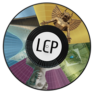

<div align="center">



# Living Culture Platform — Godot Editor

An open-source 3D environment authoring, curation, and exploration suite built in **Godot Engine 4.x** for the **Living Culture Platform (LCP)**.

[](LICENSE)
[](https://godotengine.org)
[]()

</div>

---

## Overview

The **Living Culture Platform Godot Editor** (LCP Editor) bridges semantic cultural heritage databases with real-time 3D environments. It allows domain curators, cultural operators, and archaeologists to author, arrange, and update virtual museum visits that remain continuously synchronized with an **Omeka S** digital repository.

The project is structured around two dedicated custom add-ons:

* **[Curator Dock](godot-main-project/addons/curator_dock/Readme.md)**: The editorial console embedded into the Godot editor. It provides a visual, no-code workflow for connecting to Omeka S, filtering by Item Set, downloading/creating scenes, editing object layouts and appearances (Mise-en-scène), previewing captions in 3D, and uploading finalized scenes to Nextcloud/WebDAV.
* **[Living Platform Plugin](godot-main-project/addons/living_platform_plugin/README.md)**: The underlying data and runtime engine. It handles Omeka REST API synchronization, fingerprint-cached media downloads, automatic collider and curved-screen generation, spatial audio, dynamic event logic, and dual player locomotion (Desktop First-Person and OpenXR VR).

```
┌────────────────────────────────────────────────────────┐
│                      Omeka S DB                        │
│         (Metadata, Participatory Items, Events)        │
└───────────────▲────────────────────────▲───────────────┘
                │                        │
       REST API │               WebDAV   │ Remote .tscn
                ▼                        ▼
┌───────────────────────────┐    ┌───────────────────────┐
│     Curator Dock          │    │      Nextcloud        │
│   (Editorial Console)     │    │   (Curated Storage)   │
└───────────────┬───────────┘    └───────────┬───────────┘
                │                            │
                ▼                            ▼
┌────────────────────────────────────────────────────────┐
│              Living Platform Plugin                    │
│   (Scene Graph, Media Engine, Captions, VR / Desktop)  │
└────────────────────────────────────────────────────────┘
```

---

## Documentation Subsystems

Detailed technical and user documentation is organized across dedicated guides:

| Component | Target Audience | Documentation Link |
|-----------|-----------------|--------------------|
| **Living Platform Engine** | Developers & Technical Artists | **[`living_platform_plugin/README.md`](godot-main-project/addons/living_platform_plugin/README.md)**<br>Full class reference (`LivingItem`, `LivingEnvironment`, `LivingArea`, `LivingObject`), typed media visualizers, player locomotion, 3D captions, and autoload managers. |
| **Curator Dock Console** | Curators & Tool Developers | **[`curator_dock/Readme.md`](godot-main-project/addons/curator_dock/Readme.md)**<br>Four-layer dock architecture (Services, Panels, Session, Docks), Mise-en-scène matrix, Item-Set filtering, and remote scene I/O. |
| **Curator User Guide** | Archaeologists & Curators | **[`Docs/LCP Editor - Guida Curatori.md`](Docs/LCP%20Editor%20-%20Guida%20Curatori.md)**<br>Complete Italian-language editorial walkthrough for scene creation, placement, and export.

---

## Project Structure

```
lcp-editor/
├── README.md                           # Main high-level documentation (this file)
├── LICENSE                             # GNU General Public License v3.0
└── godot-main-project/                 # Main Godot project
    ├── project.godot                   # Engine configuration, autoloads, and plugins
    ├── addons/
    │   ├── living_platform_plugin/     # Core runtime & media engine (see README)
    │   ├── curator_dock/               # Editor console dock (see Readme)
    │   ├── ffmpeg/                     # Multiplatform GDExtension for MP4 video decoding
    │   ├── godot-xr-tools/             # OpenXR locomotion and VR interaction tools
    │   └── godotopenxrvendors/         # Vendor loaders for OpenXR (Meta Quest, etc.)
    ├── curated_scenes/                 # Local directory for curated scene (.tscn) files
    └── downloaded_living_media/        # Local fingerprint cache for Omeka media & metadata
```

---

## Key Features

* **Bi-directional Omeka S Synchronization**:
  * Multi-phase build pipeline: tree prefetch, fingerprint-cached media downloads (validating `ETag`, `Last-Modified`, `Content-Length`), and typed scene-tree instantiation.
  * Environments can be filtered by **Item Set** directly inside the editor dock.
* **Multimodal 3D Media Support**:
  * **Static & Animated 3D Models** (GLB/GLTF).
  * **Images & Videos** with real-time cylindrical curvature (concave/convex) and diagonal scaling.
  * **Native MP4 Video Playback** via bundled FFmpeg GDExtension.
  * **360° Panoramic Video** on inverted spherical projection.
  * **Spatial Audio** with 3D attenuation, custom rolloff curves, and low-pass filtering.
  * **Dynamic Crowds** traversing navigation meshes with configurable density.
  * **Slideshow Carousels** with 3D in-world controls and decorative frames.
  * **Stargate Portals** for seamless teleports between virtual environments.
  * **Target Markers** with procedural chalk borders and custom hand-drawn shader aesthetics.
* **Dual Locomotion & Guided Visits**:
  * Automatically switches between **Desktop FPS** (keyboard/mouse) and **OpenXR VR** (headsets & 6-DOF controllers).
  * **Visit Navigator**: Steps through the environment's `visit_path` sequentially (keys `N`/`P` or VR controller buttons), teleporting the user to each object's floor-level `LivingVisitPoint`.
* **In-World 3D Captions**:
  * **Floating HUD**: Short descriptive text floating in front of the camera, adapting scale with distance.
  * **Long Caption**: Detailed descriptive panel and catalog metadata positioned in 3D space with dedicated audio cues.
  * **Editor Preview**: Curators can preview caption placement directly in the 3D viewport without launching the game.
* **Dynamic State & Cross-Scene Persistence**:
  * `LivingSceneManager` caches visited environments off-tree to preserve dynamic state, video positions, and avatar positions during stargate transitions.
  * `LivingEventManager` and `LivingSessionManager` process trigger-precondition-action events using global `ENTITY:VARIABLE:VALUE` tokens.

---

## Getting Started

### Prerequisites

* **Godot Engine 4.5+** (Standard edition).
* Network access to the target **Omeka S** instance (e.g. `https://omekas.livingculture.it`) and **Nextcloud/WebDAV** storage.
* *(Optional)* A VR headset supporting **OpenXR** (e.g. Meta Quest via Link/AirLink or PCVR) for immersive exploration.

### Setup

1. Clone the repository:
   ```bash
   git clone https://gitlab.di.unito.it/living-culture/lcp-editor.git
   ```
2. Open Godot Engine and import the project located in `godot-main-project/`.
3. Ensure the required plugins are active in **Project → Project Settings → Plugins**:
   - `curator_dock`
   - `living_platform_plugin`
   - `godot-xr-tools`
4. The **Curator** dock will appear in the right-hand panel of the editor.
5. In the **DATABASE** section, set your Omeka S URL and click **Fetch Environments** (or filter by **Item Set**) to start curating.

---

## License

This project is licensed under the **GNU General Public License v3.0** — see the [LICENSE](LICENSE) file for details.
