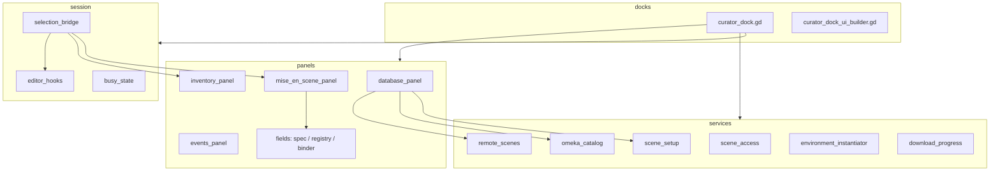

# Curator Dock

Editor plugin for preparing and updating **LivingEnvironment** scenes inside Godot without touching low-level platform code.

When enabled, a side **Curator** panel lets you:

- Connect to OmekaS and browse environments
- Download, create, save, and upload curated `.tscn` files
- Inspect the scene inventory (areas and typed `Living*Object` nodes)
- Edit **Mise-en-scène** per selection: State, typed Layout, Appearance, and Behavior
- Read environment **Events** (Omeka-driven, read-only)
- Restore components and media from Omeka after opening a scene

If `living_platform_plugin` is the data/media engine, **Curator Dock** is the operational console that makes it usable by the editorial team.

---

## Architecture

The dock is split into four layers. Each layer has a single responsibility:

```
docks/          Shell: wire UI, orchestrate refresh, status bar
panels/         One visible section of the dock = one panel controller
services/       Backend logic: no Controls, no editor signals
session/        Shared runtime state + bridges between editor and UI
```



**Rule of thumb**

| Layer | Answers |
|-------|---------|
| **Service** | *How* does it work? (I/O, Omeka, scene bootstrap) |
| **Panel** | *What* does the curator see and click? |
| **Session** | *What is shared* between panels, and how does the editor talk to the UI? |
| **Dock shell** | *Who wires and refreshes everything?* |

---

## Folder layout

```
addons/curator_dock/
  plugin.cfg
  curator_plugin.gd          # EditorPlugin entry point
  docks/
    curator_dock.gd          # Shell
    curator_dock_ui_builder.gd
  services/
    curator_scene_access.gd
    curator_remote_scenes.gd
    curator_omeka_catalog.gd
    curator_scene_setup.gd
    curator_environment_instantiator.gd
    curator_download_progress.gd
  panels/
    curator_database_panel.gd
    curator_inventory_panel.gd
    curator_events_panel.gd
    curator_mise_en_scene_panel.gd
    fields/
      curator_field_spec.gd
      curator_field_registry.gd
      curator_field_binder.gd
  session/
    curator_busy_state.gd
    curator_selection_bridge.gd
    curator_editor_hooks.gd
  profiles/                  # Optional EditorFeatureProfile (Developer / Curator)
  icons/                     # Tree icons (area / element)
```

---

## Script reference

### Entry point

#### `plugin.cfg`
Godot plugin manifest (name, version, script path).

#### `curator_plugin.gd` — `EditorPlugin`
- Instantiates `curator_dock.gd` and injects `EditorInterface` and `EditorUndoRedoManager`
- Adds the panel to the right dock slot
- Applies an optional **EditorFeatureProfile** from `profiles/` (Developer or Curator)
- Removes the dock on plugin disable

---

### `docks/` — shell and UI construction

#### `curator_dock.gd`
Thin orchestrator (~260 lines). Does **not** implement business workflows directly.

- Creates **services** (`CuratorSceneAccess`, `CuratorRemoteScenes`, `CuratorOmekaCatalog`, `CuratorSceneSetup`, instantiator, download progress)
- Creates **session** objects (`CuratorBusyState`, `CuratorSelectionBridge`, `CuratorEditorHooks`)
- Creates **panels** and binds them to UI controls from the builder
- Wires signals (selection, env refresh, busy state, status bar)
- `_do_ui_refresh()` — enables/disables controls across panels
- `_do_env_refresh()` — rescans scene, rebuilds inventory tree, refreshes events
- Reacts to scene root changes (open/close environment)

#### `curator_dock_ui_builder.gd` — `CuratorDockUIBuilder`
Builds the entire dock UI in code (no `.tscn`).

- **DATABASE** collapsible section: Omeka URL, environment/scene dropdowns, Download/Create, password field
- **ENVIRONMENT** section: tab bar (**Areas + Objects** | **Events**), sticky Restore/Save footer
- **Areas + Objects** tab: `HSplitContainer` — inventory tree (left) + Mise-en-scène column (right)
- Mise-en-scène column: header, selection name/type labels, thumbnail, State, Layout (Position / Rotation / Scale), Appearance, Behavior accordions
- **Events** tab: scrollable read-only event accordions
- Shared helpers: collapsible sections, axis spinboxes, event accordion chrome, button styles

Exposes a `CuratorDockUI` inner class: typed handles to every control the panels need.

---

### `services/` — backend, no UI

#### `curator_scene_access.gd` — `CuratorSceneAccess`
Read/write access to the **open** environment and editor prefs.

- `get_environment()` / `edited_scene_root()` — resolve `LivingEnvironment` from the edited scene
- Global Omeka URL in `EditorSettings` (load/save/apply to open env)
- Per-environment save password in `EditorSettings`
- `scan_environment()` — recursive snapshot for the inventory tree (hides slideshow source children)

#### `curator_remote_scenes.gd` — `CuratorRemoteScenes`
Remote `.tscn` I/O via Nextcloud + Omeka medium URI.

- `fetch_remote_scenes_for_env()` — list scenes for a dropdown env (no open scene required)
- `download_and_setup_remote_scene()` — download, import, open, rebuild, track media
- `upload_scene()` — clean copy (strip runtime media), save temp file, upload via `LivingEnvironment`
- Emits `fetch_finished`, `upload_finished`, `workflow_progress`, `workflow_finished`

#### `curator_omeka_catalog.gd` — `CuratorOmekaCatalog`
Omeka catalog reads.

- `list_environments()` — fetch environment list for the DATABASE dropdown
- `fetch_and_save_dynamic_properties()` — optional startup sync of dynamic property tables to JSON

#### `curator_scene_setup.gd` — `CuratorSceneSetup`
Ensures minimal scene infrastructure after open or create.

- `ensure_player()` / `ensure_lights()` / `ensure_all()` — spawn camera and lights if missing (group markers prevent duplicates)

#### `curator_environment_instantiator.gd` — `CuratorEnvironmentInstantiator`
**CREATE** workflow: new curated scene from template.

- Copies `living_environment_root.tscn` into `res://curated_scenes/` with a safe dated filename
- Opens the scene, sets `item_id` and Omeka URL, runs setup, optional auto-layout dialog
- Signals: `rebuild_finished`, `auto_layout_finished`, `failed`

#### `curator_download_progress.gd` — `CuratorDownloadProgress`
Tracks media/thumbnail downloads during `LivingEnvironment.rebuild_environment()`.

- Counts pending downloads vs build completion
- Emits percentage progress so the status bar does not show "Completed" too early

---

### `panels/` — one UI section each

#### `curator_database_panel.gd` — `CuratorDatabasePanel`
DATABASE section workflows and button states.

- Fetch Omeka environments → populate `env_list`
- Fetch remote scene list → populate `scene_list` (+ Create row)
- Download or Create scene (delegates to `CuratorRemoteScenes` / instantiator)
- Save dialog (pretty/safe filename) + upload
- Restore Saved Components (rebuild + download progress)
- Owns `CuratorBusyState` transitions during long operations
- `refresh_controls()` — enable/disable Download, Save, Fetch, etc.

#### `curator_inventory_panel.gd` — `CuratorInventoryPanel`
**COMPONENTS** tree (left column).

- Renders snapshot rows with thumbnails, visibility/lock icons, indentation
- Selection restore after refresh (instance id / node path)
- `resolve_item_node_from_selection()` — map tree row → live `LivingItem` node
- Thumbnail preview for Mise-en-scène header
- Filters out `LivingContainerModelObject` and slideshow source children (via scan)

#### `curator_events_panel.gd` — `CuratorEventsPanel`
**Events** tab (read-only).

- Builds accordions from `LivingEnvironment.omeka_events`
- Resolves trigger/action labels using scene + env list metadata
- Closed by default; full width (Mise-en-scène hidden on this tab)

#### `curator_mise_en_scene_panel.gd` — `CuratorMiseEnScenePanel`
**Mise-en-scène** column (right side of Areas + Objects tab).

- Header: selection **name**, friendly **type** label (e.g. `Image`), thumbnail
- **State**: visibility and lock toggles (with undo); updates editor gizmo via selection bridge
- **Layout**: typed Position / Rotation / Scale subsections (visibility matrix per type); spinboxes + reset buttons; gizmo sync
- **Appearance / Behavior**: delegates to field binder + registry
- Hides empty accordions when nothing applies to the selected type

#### `panels/fields/curator_field_spec.gd` — `CuratorFieldSpec`
Declarative description of one editable property (name, label, section, UI kind, ranges, optional `visible_if`).

#### `panels/fields/curator_field_registry.gd` — `CuratorFieldRegistry`
**Single source of truth** for which fields appear per `Living*Object` type — mirrors inspector `@export_group("APPEARANCE")` / `@export_group("BEHAVIOR")` on platform classes.

- `specs_for(target)` — Appearance + Behavior field list
- `layout_visibility(target)` — which Layout subsections (position / rotation / scale) to show

#### `panels/fields/curator_field_binder.gd` — `CuratorFieldBinder`
Builds dynamic controls from specs, binds undo-aware edits, shows/hides Appearance and Behavior accordion blocks.

---

### `session/` — shared state and editor bridge

#### `curator_busy_state.gd` — `CuratorBusyState`
Shared flags during download, create, restore.

- `is_busy` — blocks inventory and some DATABASE actions
- `has_error` — e.g. inventory render failed outside a busy operation
- Emits `changed` for dock refresh

#### `curator_selection_bridge.gd` — `CuratorSelectionBridge`
Keeps **COMPONENTS tree** and **3D editor selection** in sync.

- List click → select node in viewport (unless hidden/locked)
- Viewport selection → highlight tree row + refresh Mise-en-scène
- `is_syncing` shield prevents feedback loops
- `apply_editor_selection_for_state()` — clear or restore gizmo after visibility/lock changes

#### `curator_editor_hooks.gd` — `CuratorEditorHooks`
Listens to Godot editor signals and forwards them to the dock.

- Selection changes (LivingItem under open env only)
- Scene tree node add/remove/rename → debounced env refresh
- Undo/redo → refresh
- Gizmo transform polling → updates Layout spinboxes (uniform scale enforcement)

---

## Mise-en-scène matrix (dock ↔ inspector)

Dock fields align with `Living*Object` inspector groups **APPEARANCE** and **BEHAVIOR**.

| Type | Appearance | Behavior | Layout notes |
|------|------------|----------|--------------|
| Image / Video / Slideshow | curvature, diagonal (+ slideshow frame extras) | show_caption (+ video pause distance, slideshow loop) | no Scale (use diagonal) |
| 3D Model | face_visible | show_caption | full transform |
| 3D Animated | — | moving, poses, speed, spawn | full transform |
| Audio | — | audio params | position only |
| Video 360° | — (radius in inspector only) | — | position only |
| Crowd | — | density | position only |
| Stargate | stargate caption text (+ colors in inspector) | — (destinations via Events) | full transform |
| Area | — | — | position + rotation, no scale |

Slideshow **source** LivingItems are hidden from inventory. Container models are excluded from the tree.

---

## Typical workflow

1. Enable the plugin in **Project → Project Settings → Plugins**.
2. Set the Omeka URL in **DATABASE** → **Update List**.
3. Select an environment → scene list loads → pick a scene or **+** to create.
4. **DOWNLOAD** or **CREATE** opens a `LivingEnvironment` under `res://curated_scenes/`.
5. Media and components sync (Restore runs automatically on download; use **RESTORE SAVED COMPONENTS** to refresh later).
6. In **Areas + Objects**, select a row → edit Mise-en-scène → **SAVE** uploads to Nextcloud.
7. Switch to **Events** to inspect triggers/actions (read-only).

---

## UX features

- Per-row visibility and lock indicators in the inventory tree
- State toggles in Mise-en-scène (visibility, lock) with undo
- Typed Layout controls with gizmo sync and per-type subsection visibility
- Uniform scale when editing via gizmo or scale spinboxes
- Auto-layout dialog after creating a new scene (optional grid placement of `LivingObject` children)
- Status bar with normalized messages and auto-clear on success
- Sticky **RESTORE** / **SAVE** footer under both ENVIRONMENT tabs

---

## Dependencies

Requires **`living_platform_plugin`**:

- Scene root: `LivingEnvironment`
- Managed nodes: `LivingItem`, `LivingArea`, `LivingObject`, typed `Living*Object` subclasses
- Omeka integration on `LivingEnvironment` (rebuild, upload, events, medium URI)
- Template: `living_environment_root.tscn`

External services:

- OmekaS API (environment metadata, dynamic properties)
- Nextcloud/WebDAV (curated `.tscn` storage per environment medium)

---

## Limitations

- Workflow assumes the edited scene root is a **`LivingEnvironment`**. Other roots disable most ENVIRONMENT features.
- Invalid Omeka URL or network failure sets error/busy states and blocks some actions.
- `_edit_lock_` is stored as node metadata and persists in the saved scene.
- Events tab is read-only; stargate destinations are driven by Omeka events, not dock Behavior fields.
- Slideshow transition tuning and `auto_hide_source_elements` are not exposed in dock v1 (inspector / defaults only).

---

## Editor profiles

Optional `.profile` files under `profiles/` restrict editor features when the plugin loads (Developer vs Curator layouts). Applied automatically if present.
