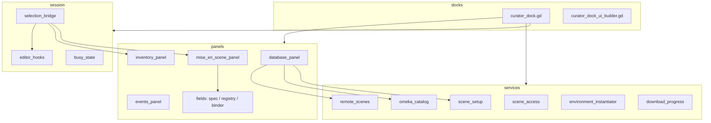

# Curator Dock

Editor plugin for preparing, curating, and updating **LivingEnvironment** scenes inside Godot without touching low-level platform code.

When enabled, the side **Curator** panel lets you:

- Connect to Omeka S, filter environments by **Item Set**, and browse remote environments
- Download, create, save, and upload curated `.tscn` scene files to Nextcloud/WebDAV
- Inspect the scene inventory (areas and typed `Living*Object` nodes, including Targets)
- Edit **Mise-en-scène** per selection: State, typed Layout (Position, Rotation, Scale, Visit Pose), Appearance, and Behavior
- Preview caption text overlays directly in the editor 3D viewport
- Read environment **Events** (Omeka-driven, read-only)
- Restore components, media assets, and metadata from Omeka S after opening a scene

If `living_platform_plugin` is the data/media engine, **Curator Dock** is the operational console that makes it usable by domain curators and archaeologists.

---

## Architecture

The dock is split into four distinct layers following single-responsibility design:

```
docks/          Shell: wire UI, orchestrate refresh, status bar
panels/         One visible section of the dock = one panel controller
services/       Backend logic: no Controls, no editor signals
session/        Shared runtime state + bridges between editor and UI
```


```mermaid
flowchart TB
  subgraph docks
    CD[curator_dock.gd]
    UIB[curator_dock_ui_builder.gd]
  end
  subgraph panels
    DB[database_panel]
    INV[inventory_panel]
    EVT[events_panel]
    MISE[mise_en_scene_panel]
    FLD[fields: spec / registry / binder]
  end
  subgraph services
    ACC[scene_access]
    REM[remote_scenes]
    CAT[omeka_catalog]
    SET[scene_setup]
    INST[environment_instantiator]
    DL[download_progress]
  end
  subgraph session
    BUSY[busy_state]
    SEL[selection_bridge]
    HOOKS[editor_hooks]
  end
  CD --> panels
  CD --> services
  CD --> session
  DB --> REM
  DB --> CAT
  DB --> SET
  MISE --> FLD
  SEL --> HOOKS
  SEL --> INV
  SEL --> MISE
```

**Rule of thumb**

| Layer | Answers |
|-------|---------|
| **Service** | *How* does it work? (I/O, Omeka, Nextcloud, scene bootstrap) |
| **Panel** | *What* does the curator see and click? |
| **Session** | *What is shared* between panels, and how does the editor talk to the UI? |
| **Dock shell** | *Who wires and refreshes everything?* |

---

## Folder layout

```
addons/curator_dock/
  plugin.cfg
  curator_plugin.gd          # EditorPlugin entry point
  docks/
    curator_dock.gd          # Orchestrator shell
    curator_dock_ui_builder.gd # Dynamic procedural UI builder
  services/
    curator_scene_access.gd  # Read/write scene access and editor settings
    curator_remote_scenes.gd # Nextcloud/WebDAV scene download/upload
    curator_omeka_catalog.gd # Omeka S catalog & item-set queries
    curator_scene_setup.gd   # Spawns default camera and lights
    curator_environment_instantiator.gd # Template instantiation (CREATE)
    curator_download_progress.gd # Rebuild download progress tracking
  panels/
    curator_database_panel.gd # Database, item-set filter, remote scenes
    curator_inventory_panel.gd # Components tree (Areas, Objects, Targets)
    curator_events_panel.gd  # Omeka events inspector (read-only)
    curator_mise_en_scene_panel.gd # Selection inspector (State, Layout, Appearance, Behavior)
    fields/
      curator_field_spec.gd  # Property spec definitions
      curator_field_registry.gd # Single source of truth for typed field matrix
      curator_field_binder.gd # Dynamic control generation and undo/redo binding
  session/
    curator_busy_state.gd    # Shared async operation flags
    curator_selection_bridge.gd # Synchronizes Tree selection and 3D Viewport gizmos
    curator_editor_hooks.gd  # Hooks into Godot editor signals (undo, gizmo, tree mutations)
  profiles/                  # EditorFeatureProfile files (Developer vs Curator)
  icons/                     # Tree row type icons (letter-a.png, letter-o.png)
```

---

## Script reference

### Entry point

#### `plugin.cfg`
Godot plugin manifest declaring the plugin name, version, and entry script.

#### `curator_plugin.gd` — `EditorPlugin`
- Instantiates `curator_dock.gd` and injects `EditorInterface` and `EditorUndoRedoManager`.
- Registers the Curator dock in the right dock slot (`DOCK_SLOT_RIGHT_UL`).
- Applies an optional **EditorFeatureProfile** from `profiles/` (`Curator.profile` or `Developer.profile`).
- Cleans up and frees dock instances when disabled.

---

### `docks/` — shell and UI construction

#### `curator_dock.gd`
Central orchestrator (~260 lines). Does not implement low-level workflows directly:
- Instantiates backend **services** (`CuratorSceneAccess`, `CuratorRemoteScenes`, `CuratorOmekaCatalog`, `CuratorSceneSetup`, `CuratorEnvironmentInstantiator`, `CuratorDownloadProgress`).
- Instantiates **session** bridges (`CuratorBusyState`, `CuratorSelectionBridge`, `CuratorEditorHooks`).
- Binds **panels** to procedural controls generated by `CuratorDockUIBuilder`.
- Connects cross-panel signals (selection changes, environment rebuilds, busy status, status bar messages).
- Coordinates `_do_ui_refresh()` and `_do_env_refresh()`.
- Detects edited scene root switches (opening or closing an environment).

#### `curator_dock_ui_builder.gd` — `CuratorDockUIBuilder`
Builds the entire dock interface procedurally in GDScript (no `.tscn` dependencies):
- **Global Status Bar**: Fixed at the top, showing normalized operation feedback and progress.
- **DATABASE Section**:
  - Database URL input.
  - **Item-Set** dropdown + fetch button (filters environments by Omeka S Item Set).
  - **Environment** dropdown + fetch button.
  - **Scene** dropdown + fetch button (`DOWNLOAD` or `CREATE` action).
  - Nextcloud password input.
- **ENVIRONMENT Section**:
  - Two-tab layout: **Areas + Objects** | **Events**.
  - Sticky footer: **RESTORE SAVED COMPONENTS** and **SAVE** buttons.
- **Areas + Objects Tab**:
  - Horizontal split container: **COMPONENTS** tree (left) + **MISE-EN-SCÈNE** column (right).
- **MISE-EN-SCÈNE Column**:
  - Header: Selection name, friendly type label (e.g. `Image`, `Target`, `3D Model`), item thumbnail.
  - **State**: Visibility toggle and editor lock toggle (with undo/redo).
  - **Layout**: Position, Rotation, Scale (uniform scaling enforced), and Visit Pose (Visit Position / Visit Rotation) with axis spinboxes and reset buttons.
  - **Preview Captions**: Toggle button for live 3D text and HUD preview.
  - **Appearance** and **Behavior**: Collapsible accordion blocks populated dynamically via `CuratorFieldBinder`.
- **Events Tab**:
  - Full-width scrollable list of Omeka event accordions.
- Exposes `CuratorDockUI`: Strongly typed data structure containing handles to all constructed controls.

---

### `services/` — backend logic, no UI

#### `curator_scene_access.gd` — `CuratorSceneAccess`
Provides read/write access to the active scene root and editor preferences:
- `get_environment()` / `edited_scene_root()`: Resolves the `LivingEnvironment` root from the open scene.
- Persists global Omeka URL and per-environment save passwords in Godot's `EditorSettings`.
- `scan_environment()`: Creates a recursive snapshot dictionary of the scene graph for the inventory tree (excluding internal slideshow source items and container sub-scenes).

#### `curator_remote_scenes.gd` — `CuratorRemoteScenes`
Handles remote `.tscn` I/O via Nextcloud/WebDAV using Omeka S medium URIs:
- `fetch_remote_scenes_for_env()`: Queries remote scene files for a selected environment without requiring the scene to be open.
- `download_and_setup_remote_scene()`: Downloads, re-imports, opens, runs default setup, and tracks media downloads.
- `upload_scene()`: Strips transient runtime media nodes, creates a clean temporary `.tscn`, and uploads it to Nextcloud using the environment's password.
- Emits `fetch_finished`, `upload_finished`, `workflow_progress`, `workflow_finished`.

#### `curator_omeka_catalog.gd` — `CuratorOmekaCatalog`
Handles catalog-level read queries to Omeka S:
- `list_item_sets()`: Fetches all available item sets from Omeka S.
- `list_environments(host, base_url, item_set_id)`: Fetches environments, optionally filtered by `item_set_id`.
- `fetch_and_save_dynamic_properties()`: Syncs dynamic properties tables from Omeka S to `omeka_dynamic_properties_table.json`.

#### `curator_scene_setup.gd` — `CuratorSceneSetup`
Guarantees base environment infrastructure after opening or creating scenes:
- `ensure_player()`: Spawns `LivingCamera` (`living_camera.tscn`) tagged with group marker `curator_player` if missing.
- `ensure_lights()`: Spawns `LivingLights` (`living_lights.tscn`) tagged with group marker `curator_lights` if missing.
- `ensure_all()`: Runs both checks in sequence.

#### `curator_environment_instantiator.gd` — `CuratorEnvironmentInstantiator`
Implements the **CREATE** workflow for new scenes:
- Clones `living_environment_root.tscn` into `res://curated_scenes/` with a dated filename.
- Opens the scene, initializes `item_id` and `OMEKA_BASE_URL`, runs setup, and triggers the optional auto-layout dialog.
- Emits `rebuild_finished`, `auto_layout_finished`, `failed`.

#### `curator_download_progress.gd` — `CuratorDownloadProgress`
Tracks asset and thumbnail downloads during `LivingEnvironment.rebuild_environment()`:
- Monitors pending HTTP requests across the scene hierarchy.
- Emits normalized percentage progress to prevent the status bar from declaring completion prematurely.

---

### `panels/` — visible panel controllers

#### `curator_database_panel.gd` — `CuratorDatabasePanel`
Manages the DATABASE collapsible section:
- Fetches Item Sets → populates `item_set_list`.
- Filters and fetches Environments → populates `env_list`.
- Fetches remote scenes for the selected environment → populates `scene_list` (including the `+` Create Scene row).
- Executes Download or Create workflows (delegating to `CuratorRemoteScenes` or `CuratorEnvironmentInstantiator`).
- Manages password persistence and scene upload dialogs.
- Triggers "Restore Saved Components" (scene rebuild + progress tracking).
- Coordinates `CuratorBusyState` transitions to disable UI during async operations.

#### `curator_inventory_panel.gd` — `CuratorInventoryPanel`
Manages the **COMPONENTS** tree on the left side of the Areas + Objects tab:
- Renders hierarchical snapshot rows with indentation, thumbnails, and state icons.
- Displays inline visibility toggles (eye icon) and lock toggles (lock icon).
- Maintains row selection across refreshes using instance IDs and node paths.
- Maps selected tree rows to active `LivingItem` nodes (`resolve_item_node_from_selection()`).
- Filters out container model sub-scenes and slideshow source elements.

#### `curator_events_panel.gd` — `CuratorEventsPanel`
Manages the **Events** tab:
- Renders read-only collapsible accordions for each `LivingEvent` stored in `LivingEnvironment.omeka_events`.
- Resolves human-readable labels for triggers, arguments, preconditions, and actions.
- Closed by default to maximize readability.

#### `curator_mise_en_scene_panel.gd` — `CuratorMiseEnScenePanel`
Manages the **Mise-en-scène** column on the right side of the Areas + Objects tab:
- **Header**: Displays item name, friendly type label (`Image`, `Video`, `Target`, `3D Model`, etc.), and thumbnail.
- **State**: Toggles visibility and node lock (`_edit_lock_`) with undo/redo support; updates viewport gizmo selection.
- **Layout**:
  - Typed subsections: Position, Rotation, Scale, Visit Position, and Visit Rotation.
  - Section visibility adapts to the selected node type (e.g. hides scale for flat media; shows visit poses only for visitable objects).
  - Reset buttons per transform component.
  - Bidirectional synchronization between spinboxes and 3D viewport gizmos (enforcing uniform scaling).
- **Preview Captions**: Toggle button (`preview_captions_btn`) calling `visitable.toggle_caption_preview()` to view HUD and text layout directly in the editor.
- **Appearance & Behavior**: Delegates dynamic control binding to `CuratorFieldBinder` using specifications from `CuratorFieldRegistry`.

#### `panels/fields/curator_field_spec.gd` — `CuratorFieldSpec`
Declarative description of an editable property:
- Defines property name, label, section (`APPEARANCE` vs `BEHAVIOR`), UI control type (bool, float, int, string, color, vector2, enum), ranges, units, and conditional visibility (`visible_if`).

#### `panels/fields/curator_field_registry.gd` — `CuratorFieldRegistry`
**Single source of truth** mapping `Living*Object` types to their editable fields:
- `specs_for(target)`: Returns Appearance and Behavior field specs matching platform export groups.
- `layout_visibility(target)`: Determines which transform subsections (Position, Rotation, Scale, Visit Position, Visit Rotation) are visible for the given type.

#### `panels/fields/curator_field_binder.gd` — `CuratorFieldBinder`
Instantiates concrete Godot controls from `CuratorFieldSpec` objects:
- Binds value changes through `EditorUndoRedoManager`.
- Updates accordion visibility when an object type has no applicable fields.

---

### `session/` — shared runtime state

#### `curator_busy_state.gd` — `CuratorBusyState`
Shared state flags during long-running tasks:
- `is_busy`: Locks inventory and database controls during downloads, rebuilds, and uploads.
- `has_error`: Indicates operation failure and preserves error messages in the status bar.
- Emits `changed` to trigger dock-wide control refreshes.

#### `curator_selection_bridge.gd` — `CuratorSelectionBridge`
Maintains bidirectional synchronization between the dock inventory tree and the Godot 3D editor selection:
- Tree row click → selects node in the 3D viewport (unless hidden or locked).
- Viewport selection → highlights the corresponding row in the tree and updates Mise-en-scène controls.
- Prevents feedback loops using an internal `is_syncing` guard.
- Handles clearing and restoring editor gizmos when visibility or lock states change.

#### `curator_editor_hooks.gd` — `CuratorEditorHooks`
Listens to native Godot editor signals and forwards them to the dock:
- Selection changes (filters to `LivingItem` nodes under the active environment).
- Scene tree additions, removals, and renames (triggers debounced tree rebuild).
- Undo/redo actions → triggers refresh.
- Gizmo transform polling → updates Layout spinboxes in real time while maintaining uniform scale.

---

## Mise-en-scène matrix (dock ↔ inspector)

The dock's Appearance and Behavior controls mirror the `@export_group("APPEARANCE")` and `@export_group("BEHAVIOR")` groups defined on platform classes:

| Type | Appearance | Behavior | Layout subsections |
|------|------------|----------|-------------------|
| **Image** (`LivingImageObject`) | `curvature`, `diagonal` | `show_caption` ("Show Text"), `show_visit_point` | Position, Rotation, Visit Pose (no Scale, uses diagonal) |
| **Video** (`LivingVideoObject`) | `curvature`, `diagonal` | `show_caption` ("Show Text"), `show_visit_point`, `auto_pause_camera_distance` | Position, Rotation, Visit Pose (no Scale, uses diagonal) |
| **Slideshow** (`LivingSlideShowObject`) | `curvature`, `diagonal`, `controls_offset_y`, `frame_opening_reference_size`, `frame_surface_offset` | `show_caption` ("Show Text"), `show_visit_point`, `loop_slides` | Position, Rotation, Visit Pose (no Scale, uses diagonal) |
| **3D Model** (`Living3DModelObject`) | `face_visible` | `show_caption` ("Show Text"), `show_visit_point` | Position, Rotation, Scale, Visit Pose |
| **3D Animated** (`Living3DModelAnimatedObject`) | — | `moving`, `random_poses_playing`, `move_speed`, `random_spawn` | Position, Rotation, Scale (no Visit Pose) |
| **Target** (`LivingTargetObject`) | `border_visible`, `border_color`, `border_thickness_h`, `border_thickness_v`, `border_corner_radius`, `border_y`, `border_text`, `border_text_visible`, `border_name_font_size`, `chalk_wear` | `show_caption` ("Show Text"), `show_visit_point` | Position, Rotation, Scale, Visit Pose |
| **Audio** (`LivingAudioObject`) | — | `autoplay`, `loop`, `volume_db`, `max_db`, `pitch_scale`, `unit_size`, `max_distance`, `attenuation_model`, `max_polyphony`, `panning_strength`, `bus`, `attenuation_filter_cutoff_hz`, `attenuation_filter_db` | Position only (no Rotation, no Scale) |
| **Video 360°** (`LivingVideo360Object`) | — (radius in inspector) | — | Position only (no Rotation, no Scale) |
| **Crowd** (`LivingCrowdObject`) | — | `density` | Position only (no Rotation, no Scale) |
| **Stargate** (`LivingStargateObject`) | `stargate_caption_text` (colors in inspector) | — (destinations driven by Events or inspector) | Position, Rotation, Scale |
| **Area** (`LivingArea`) | — (border in inspector) | — | Position, Rotation (no Scale) |

*Notes*:
- Visitable objects (`LivingVisitableObject`) expose **Visit Position** and **Visit Rotation** under Layout, as well as the **Preview Captions** button.
- Slideshow source `LivingItem` nodes are hidden from the inventory tree.
- Container model sub-scenes are excluded from tree recursion.

---

## Typical workflow

1. Enable `curator_dock` and `living_platform_plugin` in **Project → Project Settings → Plugins**.
2. Verify the Omeka URL in **DATABASE**.
3. (Optional) Filter by **Item Set** using the item set dropdown.
4. Select an **Environment** → remote scenes load into the scene dropdown.
5. Select an existing scene to **DOWNLOAD**, or choose `+` to **CREATE** a new scene from template.
6. The scene opens under `res://curated_scenes/`. Missing media and components are restored automatically.
7. Use **RESTORE SAVED COMPONENTS** if you need to re-sync media or metadata at any time.
8. In the **Areas + Objects** tab, select a row in the tree:
   - Adjust position, rotation, scale, or visit pose in **Layout**.
   - Use **Preview Captions** to verify 3D text positioning.
   - Fine-tune parameters in **Appearance** and **Behavior**.
9. Switch to the **Events** tab to inspect event triggers, preconditions, and actions (read-only).
10. Click **SAVE** in the sticky footer to save a clean scene copy and upload it to Nextcloud.

---

## UX features

- **Item Set filtering**: Quickly narrow down environments in large Omeka S instances.
- **Tree indicators**: Visual icons for area (`A`) vs object (`O`), item thumbnails, and interactive visibility/lock toggles.
- **Visit pose authoring**: Edit visit position and rotation offsets directly with reset buttons, aligned with the object's `LivingVisitPoint`.
- **In-editor caption preview**: Live preview of short HUD and long caption geometry without launching the game.
- **Chalk target styling**: Comprehensive authoring for `LivingTargetObject` floor borders (wear, corner radius, thickness, text).
- **Uniform scale enforcement**: Editing scale via spinbox or gizmo preserves proportions automatically.
- **Auto-layout dialog**: Optional grid placement when creating new environments from template.
- **Status bar**: High-visibility status banner with progress reporting and auto-clearing success messages.
- **Sticky footer**: Persistent **RESTORE** and **SAVE** buttons available under both ENVIRONMENT tabs.

---

## Dependencies

Requires **`living_platform_plugin`**:
- Scene root: `LivingEnvironment`.
- Node hierarchy: `LivingItem`, `LivingArea`, `LivingObject`, `LivingVisitableObject`, `LivingTargetObject`, and typed media subclasses.
- Core services: Omeka S API sync, Nextcloud/WebDAV upload, event definitions.
- Template: `living_environment_root.tscn`.

External endpoints:
- Omeka S REST API (metadata, item sets, environments, dynamic property tables).
- Nextcloud / WebDAV (scene `.tscn` file storage and authentication).

---

## Limitations

- Assumes the open scene root is a **`LivingEnvironment`**. Other root nodes disable Environment features.
- Network interruptions set busy/error states on the dock and prevent remote sync until resolved.
- Node lock state is stored as Godot metadata (`_edit_lock_`) and persists inside saved `.tscn` files.
- The Events tab is read-only; complex event authoring is managed directly in Omeka S.

---

## Editor profiles

The plugin includes `.profile` configurations in `profiles/`:
- `Curator.profile`: Streamlines the Godot editor UI for curators, hiding developer-specific docks and toolbars.
- `Developer.profile`: Full Godot engine interface for developers.

Profiles are applied automatically upon plugin initialization if present.
